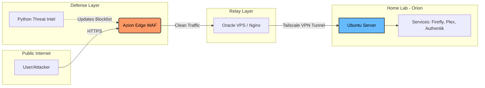

# Lorran Marques
⚙️ Linux, Distributed Systems & Security Engineering | 🚀 R&D C++ Specialist | 🐧 Linux Enthusiast

> *“A software engineer who understands how systems break, not just a hacker who knows how to run security tools.”*

# Hello, World 👋

## About Me 👨‍💻

I am a **Security & Systems Engineer** with a background in **high-performance C++ software** and **distributed platforms**.  
I work at the intersection of:

- **Application & Platform Security**
- **Linux & Cloud Infrastructure**
- **Incident Response & Reliability Engineering**
  
I spend most of my time analyzing **logs, network traces, and code paths** to understand why **real systems fail in production**, and turning that into more stable and secure platforms.
- **Fun Fact:** I have a background in **Astrophysics**, so I treat system logs like star charts—looking for patterns in the chaos. 🌌

## My Specialization 💡

| **Domain** | **Focus Areas** |
| :--- | :--- |
| **🛡️ Product Security** | WAF Engineering, Zero Trust Architecture, Threat Modeling, Incident Response (RCA), Traffic Analysis. |
| **🚀 High-Performance Dev** | Modern C++ (17/20), Graph Theory, Memory Safety, Geometric Algorithms. |
| **☁️ Systems & Cloud** | Linux, containers, networking (DNS, TLS, HTTP), reverse proxies, edge platforms |
| **🤖 Systems Automation** | Python Scripting, Linux Hardening, Bash, Edge Computing Logic (Lua/JS). |

---

## What I Work With

- **Linux & Systems:** Ubuntu, process management, file systems, containers  
- **Distributed platforms:** DNS, HTTP(S), edge computing, reverse proxies  
- **Debugging:** logs, traces, GDB, network diagnostics  
- **Security-aware engineering:** WAFs, TLS, API security, attack surface reduction  
- **Programming:** C++, Python, Bash, REST APIs  

---

## Professional & Academic Focus

I specialize in roles where **software, infrastructure and security meet**, including:

- Platform & Application Security  
- DevSecOps & cloud security  
- Incident response & escalation engineering  
- Secure systems design  

I also maintain a strong foundation in **C++ systems programming**, which allows me to analyze vulnerabilities and failures at the **code and memory level**, not just at the network layer.
  
- **Security & Defensive Engineering** Studying and applying:
  - API security & attack detection  
  - Log-driven threat analysis  
  - Edge-based protection models
 
- **Academic & Certifications**
  - 🎓 **M.Sc. Candidate in Computer Science** 
  - 🔐 Studying for **Certified Red Team Professional (CRTP)** to enhance offensive security skills.

---

## 🏗️ Featured Project — Project Orion

**Project Orion** is my personal **Linux & security lab**, where I simulate production-like environments:

- **Infrastructure:** Ubuntu Server hosting multiple containerized services.
- **Access:** Nginx reverse proxies with TLS termination and Tailscale mesh VPN for zero-trust networking.
- **Security:** Protected by commercial Edge DNS and WAF policies with custom traffic control.
- **Automation:** Python pipelines consuming threat-intelligence APIs to dynamically update firewall blocklists.

I use it to practice incident response, infrastructure hardening, observability, attack simulation and defense  

This lab is used to practice:
- Incident response and log-driven threat analysis  
- Secure architecture design  
- Attack simulation and defensive hardening  

---

## How I Think

I focus on:
- **Understanding systems end-to-end**
- **Finding the real root cause (RCA)**
- **Making platforms more reliable, secure, and debuggable**

Whether I’m inside C++ memory layouts or HTTP traffic flows, the goal is the same:  
> **Make production systems predictable and safe.**

---

## Let’s Connect
I’m always open to discussing **Linux Internals**, **Cybersecurity**, or **Geometric Algorithms**.

- **Languages:** 🇧🇷 Portuguese (Native) | 🇺🇸 English (Fluent) | 🇪🇸 Spanish (Fluent) | 🇯🇵 Japanese (Basic)

If you work with Linux platforms, distributed systems, or security engineering, feel free to reach out:

🔗 [LinkedIn](https://linkedin.com/in/lgmarques)  
💻 [GitHub](https://github.com/lgmarques9963)

